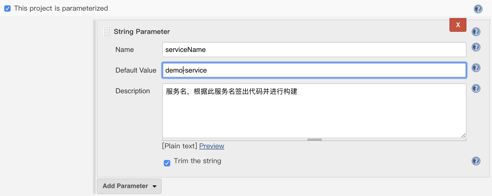
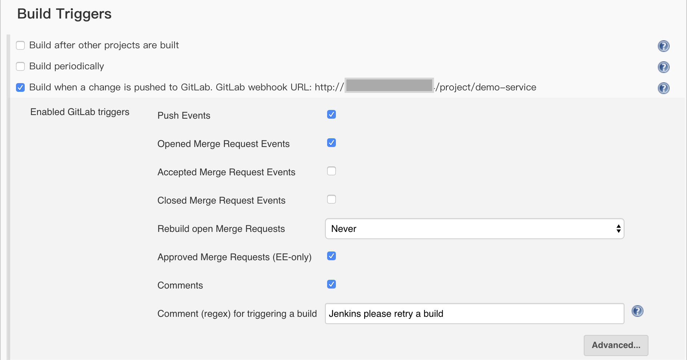
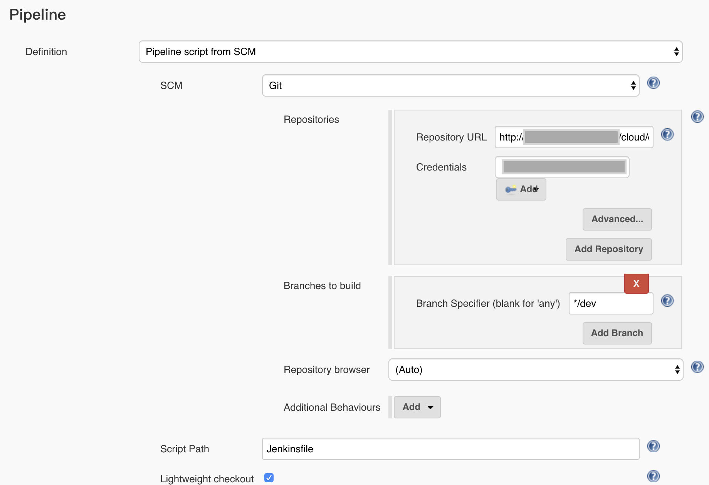

# 在项目中应用Pipeline

## 1. 创建项目

我们以一个标准的`maven`项目为例说明如何在项目中应用`Jenkins`的`Pipeline`。

```
├── Dockerfile
├── docs
├── pom.xml
├── README.md
└── src
    ├── main
    │   ├── java
    │   └── resources
    └── test
        ├── java
        └── resources
```

1. 创建一个标准`maven`项目，并为其取好名字，比如这个示例项目我取名为`demo-serivce`。需要注意，后续我们都会根据项目名来区分`Pipeline`中的不同项目。

2. 在项目根目录下创建`Dockerfile`，我定义的`Pipeline`在构建项目时会从项目的根目录中读取这个文件并根据`Dockerfile`打包镜像。

## 2. 在Jenkins中新建Job

> 现在的项目区分master分支与dev分支，因此每个项目都需要创建dev Job以及REL Job。
>
> 本小节的步骤描述了如何创建一个新的Pipeline类型Jenkins项目，也可以直接复制现有项目。只需要修改第二步serivceName就行了。

1. 在`Jenkins`中新建一个项目，项目类型为`Multibranch Pipeline`。

2. 在`General`标签页中勾选`This Project is parameterized`并新增一个`String Parameter`，`Name`设置为`serviceName`，`Default Value`为刚刚新建的项目名称。



3. 在`Build Triggers`标签页中勾选`Build when a change is pushed to GitLab. GitLab webhook URL: http://jenkins_url/project/demo-service`。接下来要去`GitLab`设置`WebHook`，这样每次我们提交代码就都能触发构建动作了。



4. 在`Pipeline`标签页中的`Definition`选择`Pipeline script from SCM`，表示从`git`仓库拉取`Pipeline`文件。



## 3. 修改k8s rc文件

在Pipeline中定义了自动部署到测试环境，自动测试过程。是通过调用k8s http api来实现的，将rc文件放入版本库中，替换当前镜像版本。

我将k8s相关的部署文件放入了版本管理中，文件夹结构如下：

```
├── configmap
├── srv
│   └── demo-service-srv.json
├── rc
│   ├── demo-service.json
├── deployment
├── pv-pvc
```

可以看到，文件是通过项目名进行命名的，在构建过程中，会根据第一节所描述的`serviceName`来查找到具体的文件并进行修改其中的镜像版本等。